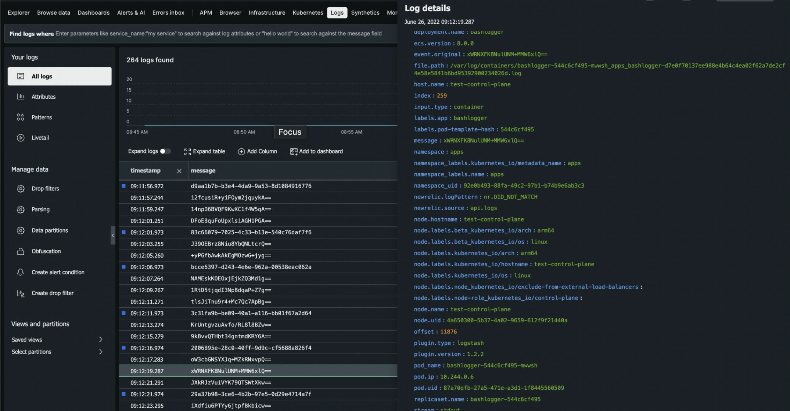
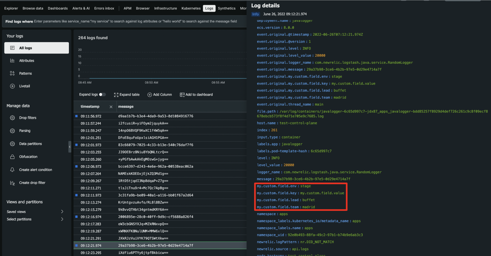

# Introduction

This repo is dedicated to show how to enrich and forward the logs generated from applications with different stacks running in Kubernetes with Filebeat and Logstash to New Relic.

# Setup

The demo can be run on any Kubernetes cluster. Yet since it's just a demo, `kind` is highly recommended. `kind` is a tool to create a Kubernetes cluster in a Docker container. Therefore, it's very useful for test cases with small loads.

## Create Kubernetes cluster

1. Run `kind create cluster --name test` (To clean up the cluster: `kind delete cluster --name test`)
2. Run Docker Desktop with Kubernetes extension

## Set environment variables

Since we are forwarding the logs to New Relic, we have to set the license key to Logstash config. This is automatically done in the setup script but the environment variable `NEWRELIC_LICENSE_KEY` has to be set.

The other environment variable is your Docker Hub account name which is to be set per `DOCKERHUB_NAME`. Be sure that you are logged in to your Docker Hub account.

## Set New Relic Logs API

Within the setup script `infra/scripts/run_setup.sh`, the New Relic Logs API is hardcoded as `https://log-api.eu.newrelic.com/log/v1`. If your New Relic account where you want to forward the logs to is in US, you have to rename it to `https://log-api.newrelic.com/log/v1`.

## Run setup script

After finishing all the steps above, you're ready to go! Just run the `infra/scripts/run_setup.sh`. It will:
1. Build the custom Docker images for the applications
2. Push the images to your Docker Hub
3. Deploy the helm charts for the applications

# Configuration

## Filebeat

Our filebeat application is configured as a DaemonSet (although we have just one node, this is the recommended way).

We grant the filebeat some specific roles so that it can scrape the logs out of the node. We specifically dictate that it should only scrape the logs that are generated from the namespace `apps`.

All the configuration is to be found within the helm charts.

## Logstash

Logstash does not contain New Relic output plugin by default. Therefore we install that plugin within the Docker file and create an extended Logstash Docker image.

In order to forward the logs to New Relic, we add the following snippet into the `logstash.conf`:
```
output {
  newrelic {
    license_key => "{{ .Values.newRelicLicenseKey }}"
    base_uri => "{{ .Values.newRelicLogsApi }}"
  }
}
```

# Results

## Bash

Our first logger is just a bash container. This container is just logging random strings with `openssl` to `STDOUT`.

### New Relic UI


## Java

Our second logger is a Java Spring Boot application. Like the bash logger, the Java logger is also logging random UUIDs to `STDOUT`.

Additionally, it uses the `slf4j - MDC` in order to enrich the logs with some tags.

### Static tags

Within the `logback-spring.xml` file, a custom attribute of `my.custom.field.key` and `my.custom.field.value` to be found. This is automatically appended to every log by default.

### Dynamic tags

Within the `RandomLogger` class, the MDC is used to add the following tags with random values:
1. `my.custom.field.env`
2. `my.custom.field.lead`
3. `my.custom.field.team`

### New Relic UI

